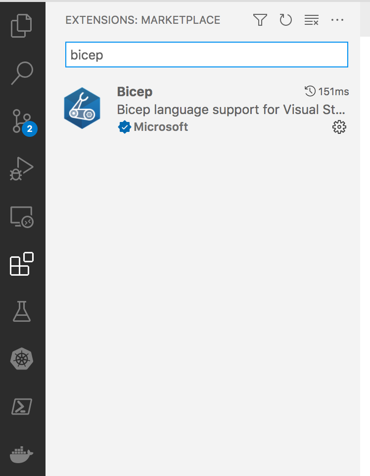

# Azure bicep

After doing Terraform for a while it is time to look at Azure Bicep.

# Pre-requesites

* VSCode
* Azure CLI
* Azure subscription

# Starter

Create a folder for your bicep files

```
mkdir bicep
cd bicep
```

Make sure you install the VSCode extension




# Basic structure

Create a file called main.bicep.

The VSCode extension has intellisense built in. 

Start typing storage and you will intellisense will bring up the bicep storage resource. Tab for completion and you will get a completed block:

```
resource storageaccount 'Microsoft.Storage/storageAccounts@2021-02-01' = {
  name: storageAccountName
  location: storageLocation
  kind: 'StorageV2'
  sku: {
    name: 'Premium_LRS'
  }
}
```

To pass parameters into the block aboe the resource block add two parameters for storageAccountName and storageAccountLocation

```
@minLength(3)
@maxLength(24)
param storageAccountName string
param storageLocation string

resource storageaccount 'Microsoft.Storage/storageAccounts@2021-02-01' = {
  name: storageAccountName
  location: storageLocation
  kind: 'StorageV2'
  sku: {
    name: 'Premium_LRS'
  }
}


```


Start typing

```
 az group create --name rg-uks-storage --location uksouth
```